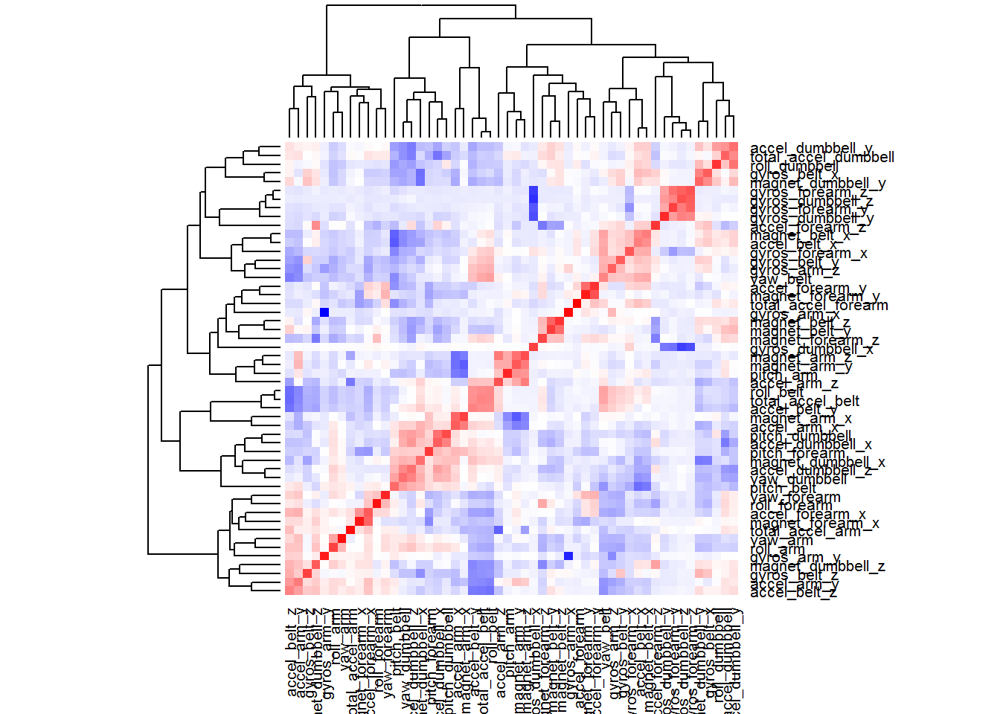
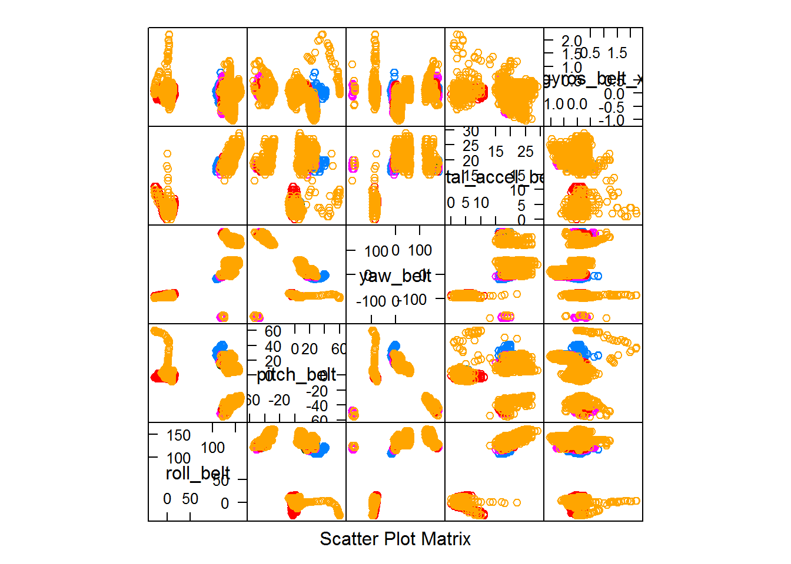

# Practical Machine Learning Assignment
## Exercise Technique Prediction Algorithm

<hr>

### Summary

Machine learning is a valuable tool for data analysis in the information age.  We apply some machine learning techniques in R to the [Weight Lifting Exercise Technique](http://groupware.les.inf.puc-rio.br/har#weight_lifting_exercises) data set [1].

The Weight Lifting Exercise Technique data set measured six participants performing the Unilateral Dumbbell Biceps Curl and classified their technique into one of five classes:

A. Exactly according to specification

B. Common mistake: throwing the elbows to the front

C. Common mistake: lifting the dumbbell only halfway

D. Common mistake: lowering the dumbbell only halfway

E. Common mistake: throwing the hips to the front 

Our aim is to use their data set to construct a machine learning algorithm that can accurately predict the technique, given a set of input data.  We use a random forrest algorithm, produced using cross-validation with n = 4 to produce a prediction algorithm with an estimated out-of-sample error of only **0.33%**.


<hr>

### Data Collection


```r
### Required packages
suppressMessages(require(randomForest))
suppressMessages(require(caret))
suppressMessages(require(grDevices))
```

We begin by downloading the raw data files and extracting the training and testing data sets.


```r
if(!file.exists("./pml-training.csv")){
    download.file("https://d396qusza40orc.cloudfront.net/predmachlearn/pml-training.csv",
                  "pml-training.csv", method="libcurl")
}
if(!file.exists("./pml-testing.csv")){
    download.file("https://d396qusza40orc.cloudfront.net/predmachlearn/pml-testing.csv",
                  "pml-testing.csv", method="libcurl")
}

pml_train <- read.csv("pml-training.csv", na.strings = c("","NA"))
pml_test <- read.csv("pml-testing.csv", na.strings = c("","NA"))
```


<hr>

### Data Subsetting

We now explore the training data set.


```r
dim(pml_train)
```

```
## [1] 19622   160
```

The training set is quite large with 19622 observations of 160 variables.

A quick peruse through the data set shows that there are a *lot* of NA values.  As these values can be a challenge to deal with in machine learning algorithms, we first investigate if we need even consider them.  


```r
c(sum(complete.cases(pml_train)), sum(colSums(is.na(pml_train)) == 0))
```

```
## [1] 406  60
```

We see that only 406 of the 19622 rows are free from NA values, whereas 60 of the 160 columns are free from NA values.  

1. It is infeasible to fill in NA values in a column that only has 406/19622 non-NA values, so we cannot hope to reasonably fill in the missing data.

2. Reducing the data set from 19622 observations to 406 observations is excessive.  Besides, more observations generally means a better algorithm.

3. Reducing the potential pool of predictor variables from 160 down to 60 is reasonable.

For these reasons, we restrict our analysis to the columns that are free from NA values.  We are left considering the following 60 columns:


```r
colnames(pml_train)[colSums(is.na(pml_train)) == 0]
```

```
##  [1] "X"                    "user_name"            "raw_timestamp_part_1"
##  [4] "raw_timestamp_part_2" "cvtd_timestamp"       "new_window"          
##  [7] "num_window"           "roll_belt"            "pitch_belt"          
## [10] "yaw_belt"             "total_accel_belt"     "gyros_belt_x"        
## [13] "gyros_belt_y"         "gyros_belt_z"         "accel_belt_x"        
## [16] "accel_belt_y"         "accel_belt_z"         "magnet_belt_x"       
## [19] "magnet_belt_y"        "magnet_belt_z"        "roll_arm"            
## [22] "pitch_arm"            "yaw_arm"              "total_accel_arm"     
## [25] "gyros_arm_x"          "gyros_arm_y"          "gyros_arm_z"         
## [28] "accel_arm_x"          "accel_arm_y"          "accel_arm_z"         
## [31] "magnet_arm_x"         "magnet_arm_y"         "magnet_arm_z"        
## [34] "roll_dumbbell"        "pitch_dumbbell"       "yaw_dumbbell"        
## [37] "total_accel_dumbbell" "gyros_dumbbell_x"     "gyros_dumbbell_y"    
## [40] "gyros_dumbbell_z"     "accel_dumbbell_x"     "accel_dumbbell_y"    
## [43] "accel_dumbbell_z"     "magnet_dumbbell_x"    "magnet_dumbbell_y"   
## [46] "magnet_dumbbell_z"    "roll_forearm"         "pitch_forearm"       
## [49] "yaw_forearm"          "total_accel_forearm"  "gyros_forearm_x"     
## [52] "gyros_forearm_y"      "gyros_forearm_z"      "accel_forearm_x"     
## [55] "accel_forearm_y"      "accel_forearm_z"      "magnet_forearm_x"    
## [58] "magnet_forearm_y"     "magnet_forearm_z"     "classe"
```

The first seven columns are of no interest to us and including them in our model increases the concern of overfitting.  Dropping these columns leaves us with 53 columns: 52 of which are potential predictor variables, and the last column, *classe*, is our outcome variable.  We subset our train and test datasets to only include these columns.  We add the *classe* variable from the training set and the *problem_id* variable from the testing set separately because those columns are unique to the respective data set.


```r
Relevant_columns <- colnames(pml_train)[colSums(is.na(pml_train)) == 0][8:59]
pml_train_short <- pml_train[, Relevant_columns]
pml_test_short <- pml_test[, Relevant_columns]

pml_train_short <- cbind(pml_train_short, classe = pml_train$classe)
pml_test_short <- cbind(pml_test_short, problem_id = pml_test$problem_id)
```

From this point on, we set aside the test set until we have our prediction model.

<hr>

We partition the training set into two subsets: 

* 80% will go into the set *pmlTrain* and will be used to fit the model,

* 20% will go into the set *pmlVerify* and will be held back as our means of testing our model and estimating the out-of-sample error of our model.


```r
set.seed(1234)
inTrain <- createDataPartition(y=pml_train_short$classe, p=0.80, list=FALSE)
pmlTrain <- pml_train_short[inTrain,]
pmlVerify <- pml_train_short[-inTrain,]
dim(pmlTrain)
```

```
## [1] 15699    53
```


<hr>

### Exploratory Analysis

We would like to see the level of correlation between the different predictor variables.


```r
corrs <- cor(pml_train_short[1:52])
cc <- colorRampPalette(c("blue", "white", "red"))
heatmap(corrs, col=cc(256))
```

 

The blue colors represent negative correlation and the red colors represent positive correlation.  Darker colors indicate stronger correlation.  Notice that much of the heatmap is light blue and red in color, with much of it being nearly white.  This indicates that most of the predictor variables are relatively uncorrelated.  For this reason, we do not feel the need to preprocess our data with principal component analysis.

In addition, we would like to perform some exploratory plots for a handful of the variables.  For brevity-sake in this report, we only show the first 5 predictor variables against the classe variable.  We found similar results when plotting other subsets of variables against the classe variable.


```r
featurePlot(x=pml_train_short[1:5], y=pml_train_short$classe, plot="pairs")
```

 

Notice that many of the plots have nonlinear interactions.  On the other hand, the plots tend to be clusters of closely-related points.  This leads us to believe that tree-based algorithms would be good candidates for a prediction model.  We will therefore try using a random forrest algorithm to build our model.


<hr>

### Model Selection


We use a random forrest algorithm to model the data.  As a compromise between finding an accurate model and having a reasonable computation time, we have overridden the caret default of performing bootstrapping with n=25, instead using a cross-validation model with n=4.  This model was compiled once, then saved to a file finalModel.RData.  All subsequent runs used the saved file.


```r
### Code to produce (and save) the final prediction model.

# set.seed(10000) #for reproducibility
# finalModel <- train(classe ~ ., data=pmlTrain, method="rf", 
#                     trControl = trainControl(method = "cv", number = 4))
# save(finalModel, file="finalModel.RData")

### Once the above code has been run once, it suffices to reload the saved model.

load("finalModel.RData")
finalModel
```

```
## Random Forest 
## 
## 15699 samples
##    52 predictor
##     5 classes: 'A', 'B', 'C', 'D', 'E' 
## 
## No pre-processing
## Resampling: Cross-Validated (4 fold) 
## Summary of sample sizes: 11775, 11773, 11776, 11773 
## Resampling results across tuning parameters:
## 
##   mtry  Accuracy   Kappa      Accuracy SD  Kappa SD   
##    2    0.9906367  0.9881547  0.001301963  0.001648800
##   27    0.9920384  0.9899283  0.002799089  0.003541792
##   52    0.9867508  0.9832387  0.002059724  0.002605090
## 
## Accuracy was used to select the optimal model using  the largest value.
## The final value used for the model was mtry = 27.
```


<hr>

### Model Evaluation

We now test our model on the *pmlVerify* data set to see how good a fit we have and to estimate the out of sample error for out algorithm.


```r
pred <- predict(finalModel, pmlVerify)
table(pred, pmlVerify$classe)
```

```
##     
## pred    A    B    C    D    E
##    A 1116    5    0    0    0
##    B    0  753    3    0    0
##    C    0    1  680    2    0
##    D    0    0    1  641    1
##    E    0    0    0    0  720
```

We have a very good fit with only a handful of misclassifications.  The accuracy of our model on this set is 99.67%:


```r
predRight <- pred==pmlVerify$classe
accuracy <- sum(as.numeric(predRight))/length(predRight)
accuracy*100
```

```
## [1] 99.66862
```

This gives us an **out of sample error rate** of 0.33%:


```r
(1 - accuracy)*100
```

```
## [1] 0.331379
```

When this model is applied to the actual test set, we produce a 100% success rate on the 20 samples.


<hr>

### References

1. Velloso, E.; Bulling, A.; Gellersen, H.; Ugulino, W.; Fuks, H. **Qualitative Activity Recognition of Weight Lifting Exercises.** Proceedings of 4th International Conference in Cooperation with SIGCHI (Augmented Human '13) . Stuttgart, Germany: ACM SIGCHI, 2013.
